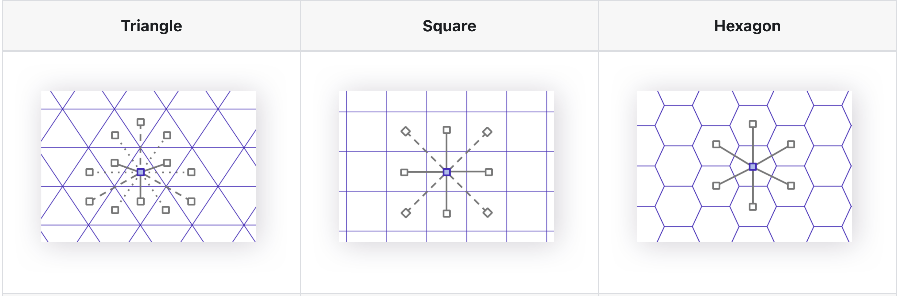

# Global local analysis
While I studied Geography one thing stuck with me. Most of the topics we dived into were either very local or very global. I always found it interesting that it seemed impossible to come up with techniques that could be applied locally but at a global scale. This was especially true for remote sesning. I believe there were two reaosns for that:

- The data was too large to process on a local level
- There was not enough compute to process data on a local level but at a global scale

With new paradimgs. This might not be the case anymore. I believe that we can now process data at a global scale but at a local level.

## Hexagons are my favorite shape

According to the company Uber, the answer might be hexagons. So why hexagons? The key problem for goespaital analysis is to join large scale data based on the location. To do these joins efficiently you need to parition the world into predefined parts. Hxagons are amazing -- they are the most efficient way to cover a sphere. This means that you can use hexagons to cover the entire globe without any gaps or overlaps. Hexagons have some other great geometrical properties that make them great for analysis. They are symmetrical and have a constant distance to their neighbors. 

## Indexing matters
Let's take the example of doing an aggregation for agricultral fields and satellite data. Without indexing you need to cookie cut for each parcel the pixels that are within a parcel. This is a very expensive operation, because you do not know upfront which pixels are within the parcel. 
When computing an index upfront that aligns with both data sources. You can do the aggregation much easier.

## How does this hold up in practice?
- I had a closer look at mosica. Mosaic is developed by databricks and fits well into large scale data processing. The primary expense in the cloud is compute. Storing data is cheap.